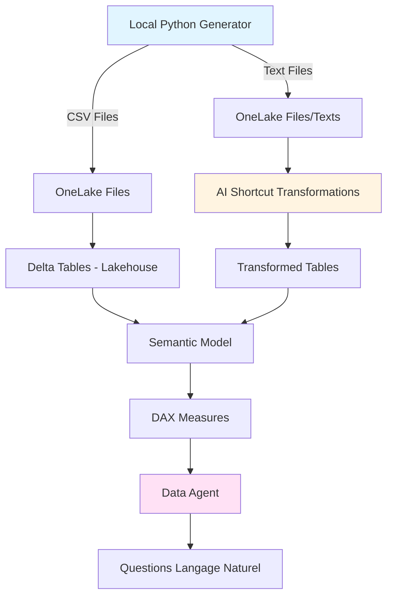

# Microsoft Fabric - Risk, Compliance & Audit avec Data Agent

## 🎯 Objectif

Démo Microsoft Fabric illustrant un **système de gestion des risques, conformité et audit** avec :
- Suivi des contrôles de conformité (SOX, GDPR, ISO 27001)
- Monitoring des incidents de sécurité et compliance
- Gestion des actions correctives et remédiation
- Évaluation des risques fournisseurs (third-party risk)
- AI Transformations sur rapports d'audit et incidents

**Persona** : Risk & Compliance Manager, Chief Audit Officer, CISO

---

## 📊 Architecture Fabric



---

## 📁 Structure du Projet

```
MF_RiskComplianceAudit/
├── README.md (ce fichier)
├── AGENTS.md (conventions développement)
├── requirements.txt (dépendances Python)
├── src/
│   ├── config.yaml (configuration génération données)
│   ├── generate_data.py (script génération)
│   └── validate_schema.py (validation schéma)
├── docs/
│   ├── schema.md (dictionnaire données complet)
│   ├── demo_story.md (scénario démo "L'Audit qui Révèle")
│   ├── questions_demo.md (15 questions Data Agent)
│   ├── fabric_setup.md (guide déploiement Fabric)
│   ├── data_agent_instructions.md (system prompt)
│   ├── data_agent_examples.md (exemples réponses)
│   └── dax_measures.md (30+ mesures DAX)
└── data/ (généré après exécution)
    └── raw/
        ├── controls.csv
        ├── control_executions.csv
        ├── incidents.csv
        ├── remediation_actions.csv
        ├── vendors.csv
        ├── audit_reports_txt/
        │   └── *.txt (100 rapports)
        └── incident_descriptions_txt/
            └── *.txt (150 descriptions)
```

---

## 📊 Données Générées

### Tables Principales

| Table | Lignes | Description |
|-------|--------|-------------|
| **controls** | 150 | Contrôles de conformité (SOX, GDPR, ISO 27001, PCI-DSS) |
| **control_executions** | ~3,000 | Exécutions des contrôles (passed, failed, not_tested) |
| **incidents** | 200 | Incidents de sécurité/compliance |
| **remediation_actions** | 180 | Actions correctives post-incident |
| **vendors** | 100 | Fournisseurs avec risk scoring |

### Fichiers Texte (AI Transformations)

| Dossier | Fichiers | Description |
|---------|----------|-------------|
| **audit_reports_txt/** | 100 | Rapports d'audit (findings, recommendations) |
| **incident_descriptions_txt/** | 150 | Descriptions détaillées d'incidents |

**Total données** : ~3,500 lignes CSV + 250 fichiers texte

---

## 🎯 Cas d'Usage et Analyses

### 1. Conformité Réglementaire

**Questions clés** :
- Où sommes-nous non conformes par framework (SOX, GDPR, ISO 27001) ?
- Quels contrôles ont échoué au dernier trimestre ?
- Quel est le taux de conformité par domaine (finance, IT, operations) ?

**Insights** :
- Identification rapide des gaps de conformité
- Drill-down par framework réglementaire
- Tendances de conformité sur 24 mois

### 2. Gestion des Incidents

**Questions clés** :
- Résume les incidents critiques des 30 derniers jours
- Quel est le MTTR (Mean Time To Remediate) par type d'incident ?
- Quels départements ont le plus d'incidents récurrents ?

**Insights** :
- Analyse sentiment des incidents (AI Transformations)
- Corrélation incidents ↔ contrôles échoués
- Coût financier des incidents (amendes, remédiation)

### 3. Risques Fournisseurs (Third-Party Risk)

**Questions clés** :
- Quels fournisseurs présentent un risque élevé ?
- Combien de fournisseurs sont non conformes au GDPR ?
- Quel est l'exposition financière aux fournisseurs critiques ?

**Insights** :
- Scoring de risque automatique (0-100)
- Alertes sur fournisseurs non audités
- Impact business des risques fournisseurs

---

## 🚀 Quick Start

### 1. Générer les Données

```bash
# Installer les dépendances
pip install -r requirements.txt

# Générer les données synthétiques
python src/generate_data.py

# Valider le schéma
python src/validate_schema.py
```

**Sortie attendue** :
```
✅ Generated 150 controls
✅ Generated 3,000 control executions
✅ Generated 200 incidents
✅ Generated 180 remediation actions
✅ Generated 100 vendors
✅ Generated 100 audit reports
✅ Generated 150 incident descriptions

📊 All data saved to data/raw/
```

### 2. Déployer dans Fabric

Voir [docs/fabric_setup.md](docs/fabric_setup.md) pour le guide complet.

**Étapes** :
1. Créer Lakehouse "Risk_Compliance_Lakehouse"
2. Upload CSV → OneLake Files
3. Créer Delta Tables (5 tables)
4. Configurer AI Transformations (audit reports, incidents)
5. Créer Semantic Model + Relations
6. Ajouter ~30 mesures DAX
7. Configurer Data Agent

**Durée** : 30-45 minutes

---

## 📈 Métriques Clés (KPIs)

### Conformité

```dax
Compliance Rate = 
DIVIDE(
    COUNTROWS(FILTER(control_executions, control_executions[status] = "passed")),
    COUNTROWS(control_executions),
    0
)
```

**Benchmark** : Taux de conformité cible > 95%

### Incidents

```dax
Critical Incidents % = 
DIVIDE(
    COUNTROWS(FILTER(incidents, incidents[severity] = "critical")),
    COUNTROWS(incidents),
    0
)
```

**Benchmark** : Incidents critiques < 5%

### Risques Fournisseurs

```dax
High Risk Vendors % = 
DIVIDE(
    COUNTROWS(FILTER(vendors, vendors[risk_score] >= 70)),
    COUNTROWS(vendors),
    0
)
```

**Benchmark** : Fournisseurs à risque < 10%

---

## 🎬 Scénario de Démo : "L'Audit qui Révèle"

### Contexte

**FinSecure Corp** est une fintech soumise à de multiples réglementations (SOX, GDPR, PCI-DSS). Le **Chief Audit Officer (CAO)**, **Marc Dubois**, prépare le Comité d'Audit trimestriel et doit répondre à 3 questions critiques :

1. **Conformité** : Sommes-nous conformes à SOX et GDPR ?
2. **Incidents** : Quels incidents ont impacté la conformité ce trimestre ?
3. **Fournisseurs** : Quels fournisseurs critiques présentent un risque ?

**Défi** : Les données sont fragmentées (Excel, emails, rapports PDF). Marc utilise **Fabric Data Agent** pour investiguer en 15 minutes.

### Questions Démo

**Phase 1 - Diagnostic Conformité** (5 min)
1. Quel est le taux de conformité global par framework réglementaire ?
2. Quels contrôles SOX ont échoué au dernier trimestre ?
3. Combien d'incidents critiques avons-nous eus ce trimestre ?

**Phase 2 - Analyse Incidents** (5 min)
4. Résume les 5 incidents critiques les plus récents
5. Quel est le MTTR moyen par type d'incident ?
6. Quels départements ont le plus d'incidents récurrents ?

**Phase 3 - Risques Fournisseurs** (5 min)
7. Quels fournisseurs ont un risk score > 70 ?
8. Combien de fournisseurs critiques ne sont pas audités depuis 12 mois ?
9. Quel est le coût total des incidents liés aux fournisseurs ?

Voir [docs/demo_story.md](docs/demo_story.md) pour le scénario complet.

---

## 📚 Documentation

| Document | Description |
|----------|-------------|
| [schema.md](docs/schema.md) | Dictionnaire de données (5 tables + 2 textes) |
| [demo_story.md](docs/demo_story.md) | Scénario "L'Audit qui Révèle" (15 min) |
| [questions_demo.md](docs/questions_demo.md) | 15 questions Data Agent |
| [fabric_setup.md](docs/fabric_setup.md) | Guide déploiement Fabric (8 étapes) |
| [data_agent_instructions.md](docs/data_agent_instructions.md) | System prompt Data Agent |
| [data_agent_examples.md](docs/data_agent_examples.md) | Exemples réponses attendues |
| [dax_measures.md](docs/dax_measures.md) | 30+ mesures DAX Risk & Compliance |

---

## 🎯 Bénéfices Métier

### Sans Fabric (Avant)

- ❌ 3-5 jours pour préparer un Comité d'Audit
- ❌ Données fragmentées (Excel, emails, SharePoint)
- ❌ Rapports d'audit non analysables (PDF statiques)
- ❌ Pas de vue temps réel de la conformité

### Avec Fabric Data Agent (Maintenant)

- ✅ **15 minutes** pour investiguer end-to-end
- ✅ **Données centralisées** dans OneLake
- ✅ **AI Transformations** sur rapports d'audit (findings extraction)
- ✅ **Alertes temps réel** sur contrôles échoués

**ROI estimé** :
- Temps gagné : 5 jours → 15 min = **99% de réduction**
- Détection précoce des risques : -30% incidents critiques
- Conformité améliorée : +5pp (90% → 95%)

---

## 🔧 Technologies Utilisées

- **Microsoft Fabric** : Lakehouse, Semantic Model, Data Agent
- **OneLake** : Stockage unifié des données
- **AI Shortcut Transformations** : Analyse rapports d'audit et incidents
- **Python 3.9+** : Génération données synthétiques
- **DAX** : Mesures métier (Compliance Rate, MTTR, Risk Exposure)

---

## 📞 Support

- **Documentation Fabric** : [Microsoft Learn](https://learn.microsoft.com/fabric/)
- **Frameworks Compliance** : [SOX](https://www.sox-online.com/), [GDPR](https://gdpr.eu/), [ISO 27001](https://www.iso.org/isoiec-27001-information-security.html)

---

*Démo créée pour Microsoft Fabric Data Agent - Risk, Compliance & Audit | Dernière mise à jour : Février 2026*
