# 📐 Mesures DAX - Risk, Compliance & Audit Analytics

## 📋 Vue d'ensemble

Ce document contient **30+ mesures DAX** pour l'analyse risque, conformité et audit dans le Semantic Model Microsoft Fabric.

**⚠️ IMPORTANT : Utilisation des Tables Silver UNIQUEMENT**

Ce Semantic Model utilise exclusivement les **tables Silver** suivantes :
- `controls`
- `control_executions`
- `incidents`
- `remediation_actions`
- `vendors`

**Pourquoi Silver et non Gold ?**
- ✅ Les tables **Silver** contiennent TOUTES les colonnes (y compris les ID : control_id, execution_id, incident_id, etc.)
- ✅ Les relations entre tables fonctionnent grâce à ces colonnes ID
- ✅ Les mesures DAX calculent les agrégations à partir des données détaillées
- ❌ Les tables **Gold** sont des agrégations sans colonnes ID → impossible de créer des relations
- ❌ Les tables Gold sont utiles pour Spark/SQL, pas pour le Semantic Model Power BI

**Tables Gold (non utilisées ici) :**
- `gold_framework_metrics` → Agrégations Spark
- `gold_incident_metrics` → Agrégations Spark
- `gold_vendor_risk` → Agrégations Spark
- `gold_remediation_metrics` → Agrégations Spark

---

## 🎯 Catégorie 1 : Métriques de Base (Counts)

### 1.1 Total Controls
```dax
Total Controls = COUNTROWS(controls)
```
**Table utilisée :** `controls` (Silver)

### 1.2 Total Executions
```dax
Total Executions = COUNTROWS(control_executions)
```
**Table utilisée :** `control_executions` (Silver)

### 1.3 Total Incidents
```dax
Total Incidents = COUNTROWS(incidents)
```
**Table utilisée :** `incidents` (Silver)

### 1.4 Total Remediation Actions
```dax
Total Remediation Actions = COUNTROWS(remediation_actions)
```
**Table utilisée :** `remediation_actions` (Silver)

### 1.5 Total Vendors
```dax
Total Vendors = COUNTROWS(vendors)
```
**Table utilisée :** `vendors` (Silver)

---

## 📊 Catégorie 2 : Compliance Rate

### 2.1 Compliance Rate (Global)
```dax
Compliance Rate = 
VAR ExecutionsPassed = CALCULATE(COUNTROWS(control_executions), control_executions[status] = "passed")
VAR TotalExecutions = COUNTROWS(control_executions)
RETURN
    DIVIDE(ExecutionsPassed, TotalExecutions, 0)
```

**Format :** Percentage (0.699 → 69.9%)

### 2.2 Compliance Rate Target
```dax
Compliance Target = 0.90
```

### 2.3 Compliance Rate Delta
```dax
Compliance Delta = [Compliance Rate] - [Compliance Target]
```

**Format :** Percentage with + sign (e.g., -20.1% si compliance = 69.9%)

### 2.4 Compliance Rate by Framework
```dax
Compliance by Framework = 
VAR SelectedFramework = SELECTEDVALUE(controls[framework])
VAR ControlsFiltered = FILTER(controls, controls[framework] = SelectedFramework)
VAR ExecutionsFiltered = 
    FILTER(
        control_executions,
        control_executions[control_id] IN VALUES(ControlsFiltered[control_id])
    )
VAR ExecutionsPassed = COUNTROWS(FILTER(ExecutionsFiltered, control_executions[status] = "passed"))
VAR TotalExecutions = COUNTROWS(ExecutionsFiltered)
RETURN
    DIVIDE(ExecutionsPassed, TotalExecutions, 0)
```

---

## 🔴 Catégorie 3 : Control Effectiveness

### 3.1 Failed Executions
```dax
Failed Executions = 
CALCULATE(
    COUNTROWS(control_executions),
    control_executions[status] = "failed"
)
```

### 3.2 Not Tested Executions
```dax
Not Tested Executions = 
CALCULATE(
    COUNTROWS(control_executions),
    control_executions[status] = "not_tested"
)
```

### 3.3 Exception Executions
```dax
Exception Executions = 
CALCULATE(
    COUNTROWS(control_executions),
    control_executions[status] = "exception"
)
```

### 3.4 Control Failure Rate
```dax
Control Failure Rate = 
DIVIDE(
    [Failed Executions],
    [Total Executions],
    0
)
```

**Format :** Percentage (0.20 → 20%)

### 3.5 Controls with High Failure (>30%)
```dax
Controls High Failure = 
VAR ControlsTable = 
    ADDCOLUMNS(
        controls,
        "FailureRate",
        VAR ControlID = controls[control_id]
        VAR TotalExec = CALCULATE(COUNTROWS(control_executions), control_executions[control_id] = ControlID)
        VAR FailedExec = CALCULATE(COUNTROWS(control_executions), control_executions[control_id] = ControlID, control_executions[status] = "failed")
        RETURN DIVIDE(FailedExec, TotalExec, 0)
    )
RETURN
    COUNTROWS(FILTER(ControlsTable, [FailureRate] > 0.30))
```

---

## 🚨 Catégorie 4 : Incidents

### 4.1 Open Incidents
```dax
Open Incidents = 
CALCULATE(
    COUNTROWS(incidents),
    incidents[status] IN {"open", "investigating"}
)
```

### 4.2 Critical/High Incidents
```dax
Critical High Incidents = 
CALCULATE(
    COUNTROWS(incidents),
    incidents[severity] IN {"critical", "high"}
)
```

### 4.3 Critical/High Open
```dax
Critical High Open = 
CALCULATE(
    COUNTROWS(incidents),
    incidents[severity] IN {"critical", "high"},
    incidents[status] IN {"open", "investigating"}
)
```

### 4.4 Incidents Detected by Controls
```dax
Incidents Detected by Controls = 
CALCULATE(
    COUNTROWS(incidents),
    incidents[execution_id] <> BLANK()
)
```

### 4.5 Incidents Discovered Otherwise
```dax
Incidents Discovered Otherwise = 
CALCULATE(
    COUNTROWS(incidents),
    incidents[execution_id] = BLANK()
)
```

### 4.6 Control Detection Rate
```dax
Control Detection Rate = 
DIVIDE(
    [Incidents Detected by Controls],
    [Total Incidents],
    0
)
```

**Format :** Percentage (0.30 → 30%)  
**Target :** >80%

---

## ⏱️ Catégorie 5 : Incident Response Time (IRT)

### 5.1 Incident Response Time (hours)
```dax
Incident Response Time = 
VAR IncidentsResolved = 
    FILTER(
        incidents,
        incidents[status] IN {"resolved", "closed"}
    )
VAR IRTTable = 
    ADDCOLUMNS(
        IncidentsResolved,
        "ResponseHours",
        DATEDIFF(
            incidents[detection_date],
            TODAY(),  // Approximation - should use actual resolution date if available
            HOUR
        )
    )
RETURN
    AVERAGEX(IRTTable, [ResponseHours])
```

**Note :** Cette mesure suppose une colonne `resolution_date` (non présente dans schéma actuel). Adapter selon besoins.

### 5.2 IRT Target (Critical)
```dax
IRT Target Critical = 24
```

**Format :** Hours

---

## 🔧 Catégorie 6 : Remediation (MTTR)

### 6.1 Mean Time To Remediate (MTTR)
```dax
MTTR = 
VAR RemediationCompleted = 
    FILTER(
        remediation_actions,
        remediation_actions[status] = "completed",
        remediation_actions[completion_date] <> BLANK()
    )
VAR MTTRTable = 
    ADDCOLUMNS(
        RemediationCompleted,
        "DaysToRemediate",
        DATEDIFF(
            remediation_actions[start_date],
            remediation_actions[completion_date],
            DAY
        )
    )
RETURN
    AVERAGEX(MTTRTable, [DaysToRemediate])
```

**Format :** Whole number (15 → 15 days)

### 6.2 MTTR Target
```dax
MTTR Target = 7
```

### 6.3 MTTR by Severity
```dax
MTTR by Severity = 
VAR SelectedSeverity = SELECTEDVALUE(incidents[severity])
VAR IncidentsFiltered = FILTER(incidents, incidents[severity] = SelectedSeverity)
VAR RemediationsFiltered = 
    FILTER(
        remediation_actions,
        remediation_actions[incident_id] IN VALUES(IncidentsFiltered[incident_id]),
        remediation_actions[status] = "completed"
    )
VAR MTTRTable = 
    ADDCOLUMNS(
        RemediationsFiltered,
        "DaysToRemediate",
        DATEDIFF(
            remediation_actions[start_date],
            remediation_actions[completion_date],
            DAY
        )
    )
RETURN
    AVERAGEX(MTTRTable, [DaysToRemediate])
```

### 6.4 Overdue Remediation Actions
```dax
Overdue Remediations = 
CALCULATE(
    COUNTROWS(remediation_actions),
    remediation_actions[status] <> "completed",
    remediation_actions[target_completion_date] < TODAY()
)
```

### 6.5 On-Time Completion Rate
```dax
On-Time Completion Rate = 
VAR CompletedOnTime = 
    CALCULATE(
        COUNTROWS(remediation_actions),
        remediation_actions[status] = "completed",
        remediation_actions[completion_date] <= remediation_actions[target_completion_date]
    )
VAR TotalCompleted = 
    CALCULATE(
        COUNTROWS(remediation_actions),
        remediation_actions[status] = "completed"
    )
RETURN
    DIVIDE(CompletedOnTime, TotalCompleted, 0)
```

---

## 🏢 Catégorie 7 : Vendor Risk

### 7.1 High-Risk Vendors (>70)
```dax
High Risk Vendors = 
CALCULATE(
    COUNTROWS(vendors),
    vendors[risk_score] > 70
)
```

### 7.2 Non-Compliant Vendors
```dax
Non-Compliant Vendors = 
CALCULATE(
    COUNTROWS(vendors),
    vendors[compliance_status] = "non_compliant"
)
```

### 7.3 Vendors with Incidents
```dax
Vendors with Incidents = 
VAR VendorsWithIncidents = 
    FILTER(
        vendors,
        CALCULATE(COUNTROWS(incidents), incidents[vendor_id] = vendors[vendor_id]) > 0
    )
RETURN
    COUNTROWS(VendorsWithIncidents)
```

### 7.4 Average Vendor Risk Score
```dax
Avg Vendor Risk Score = AVERAGE(vendors[risk_score])
```

### 7.5 Vendors Overdue Audit
```dax
Vendors Overdue Audit = 
CALCULATE(
    COUNTROWS(vendors),
    vendors[last_audit_date] < DATE(YEAR(TODAY()), MONTH(TODAY()) - 12, DAY(TODAY()))
)
```

**Logic :** Last audit >12 months ago

---

## 📅 Catégorie 8 : Time-based Metrics

### 8.1 Avg Days Since Last Audit (Vendor)
```dax
Avg Days Since Audit = 
AVERAGEX(
    vendors,
    DATEDIFF(vendors[last_audit_date], TODAY(), DAY)
)
```

### 8.2 Incidents Last 30 Days
```dax
Incidents Last 30 Days = 
CALCULATE(
    COUNTROWS(incidents),
    incidents[detection_date] >= TODAY() - 30
)
```

### 8.3 Incidents Last 90 Days
```dax
Incidents Last 90 Days = 
CALCULATE(
    COUNTROWS(incidents),
    incidents[detection_date] >= TODAY() - 90
)
```

### 8.4 Monthly Compliance Rate Trend
```dax
Monthly Compliance Trend = 
VAR SelectedMonth = SELECTEDVALUE('Calendar'[Month])
VAR ExecutionsMonth = 
    FILTER(
        control_executions,
        MONTH(control_executions[execution_date]) = SelectedMonth
    )
VAR PassedMonth = COUNTROWS(FILTER(ExecutionsMonth, control_executions[status] = "passed"))
VAR TotalMonth = COUNTROWS(ExecutionsMonth)
RETURN
    DIVIDE(PassedMonth, TotalMonth, 0)
```

**Note :** Requiert table Calendar (dimension date)

---

## 🏆 Catégorie 9 : Audit Readiness Score

### 9.1 Audit Readiness Score (0-100)
```dax
Audit Readiness Score = 
VAR ComplianceScore = [Compliance Rate] * 40
VAR IncidentScore = (1 - ([Critical High Open] / 100)) * 30
VAR RemediationScore = (1 - ([Overdue Remediations] / 50)) * 20
VAR VendorScore = (1 - ([High Risk Vendors] / 20)) * 10
RETURN
    (ComplianceScore + IncidentScore + RemediationScore + VendorScore)
```

**Composants :**
- Compliance Rate (40%) : >90% = 40 points
- Critical/High Open Incidents (30%) : <10 = 30 points
- Overdue Remediations (20%) : <5 = 20 points
- High-Risk Vendors (10%) : <10 = 10 points

**Total :** 100 points = Excellent audit readiness

### 9.2 Audit Readiness Status
```dax
Audit Readiness Status = 
SWITCH(
    TRUE(),
    [Audit Readiness Score] >= 85, "✅ Ready",
    [Audit Readiness Score] >= 70, "⚠️ Needs Improvement",
    "❌ Not Ready"
)
```

---

## 📈 Catégorie 10 : Trends & Comparisons

### 10.1 Compliance Trend (vs Previous Month)
```dax
Compliance Trend = 
VAR CurrentMonth = [Compliance Rate]
VAR PreviousMonth = 
    CALCULATE(
        [Compliance Rate],
        DATEADD('Calendar'[Date], -1, MONTH)
    )
RETURN
    CurrentMonth - PreviousMonth
```

**Note :** Requiert table Calendar

### 10.2 Incident Volume Trend
```dax
Incident Volume Trend = 
VAR CurrentPeriod = [Total Incidents]
VAR PreviousPeriod = 
    CALCULATE(
        [Total Incidents],
        DATEADD('Calendar'[Date], -1, QUARTER)
    )
RETURN
    CurrentPeriod - PreviousPeriod
```

---

## 🎨 Catégorie 11 : Conditional Formatting Helpers

### 11.1 Compliance Status
```dax
Compliance Status = 
SWITCH(
    TRUE(),
    [Compliance Rate] >= 0.90, "✅ On Target",
    [Compliance Rate] >= 0.80, "⚠️ Warning",
    "❌ Critical"
)
```

### 11.2 Incident Status Color
```dax
Incident Status Color = 
SWITCH(
    TRUE(),
    [Critical High Open] = 0, "#28A745",  // Green
    [Critical High Open] <= 10, "#FFC107", // Yellow
    "#DC3545"  // Red
)
```

**Usage :** Conditional formatting by field value

### 11.3 MTTR Status
```dax
MTTR Status = 
SWITCH(
    TRUE(),
    [MTTR] <= [MTTR Target], "✅ On Target",
    [MTTR] <= ([MTTR Target] * 1.5), "⚠️ Acceptable",
    "❌ Critical"
)
```

---

## 🔢 Catégorie 12 : Statistical Measures

### 12.1 Standard Deviation - Compliance Rate
```dax
StdDev Compliance Rate = 
STDEVX.P(
    SUMMARIZE(
        control_executions,
        controls[framework],
        "ComplianceRate", [Compliance by Framework]
    ),
    [ComplianceRate]
)
```

### 12.2 Median MTTR
```dax
Median MTTR = 
MEDIANX(
    FILTER(
        remediation_actions,
        remediation_actions[status] = "completed"
    ),
    DATEDIFF(
        remediation_actions[start_date],
        remediation_actions[completion_date],
        DAY
    )
)
```

---

## 📊 Exemples d'Utilisation dans Rapports

### Dashboard KPI Card - Compliance
```
Metric: Compliance Rate
Value: [Compliance Rate]
Target: [Compliance Target]
Trend: [Compliance Trend]
Status: [Compliance Status]
```

### Matrix - Framework Performance
```
Rows: controls[framework]
Values: 
  - [Total Controls]
  - [Total Executions]
  - [Compliance by Framework]
  - [Failed Executions]
  - [Controls High Failure]
```

### Chart - Incidents by Severity
```
Axis: incidents[severity]
Values: [Total Incidents]
Legend: [Incident Status Color]
Filter: [Critical High Open] (show only open)
```

### Table - Vendor Risk
```
Rows: vendors[vendor_name]
Values:
  - vendors[risk_score]
  - vendors[compliance_status]
  - [Vendors with Incidents]
  - vendors[last_audit_date]
Sort by: vendors[risk_score] DESC
```

---

## ✅ Checklist d'Implémentation

Dans le Semantic Model (basé sur les **tables Silver**), créer les mesures suivantes (priorité haute) :

**Must-Have (10 mesures essentielles) :**
- [ ] Compliance Rate
- [ ] Compliance Target
- [ ] Compliance Delta
- [ ] Open Incidents
- [ ] Critical High Open
- [ ] MTTR
- [ ] Overdue Remediations
- [ ] High Risk Vendors
- [ ] Audit Readiness Score
- [ ] Compliance Status

**Nice-to-Have (10 mesures supplémentaires) :**
- [ ] Compliance by Framework
- [ ] Control Failure Rate
- [ ] Control Detection Rate
- [ ] MTTR by Severity
- [ ] On-Time Completion Rate
- [ ] Non-Compliant Vendors
- [ ] Vendors Overdue Audit
- [ ] Incidents Last 30 Days
- [ ] Compliance Trend
- [ ] Incident Volume Trend

**📊 Architecture des Données :**

```mermaid
graph TB
    subgraph SEMANTIC["📈 SEMANTIC MODEL (Power BI)"]
        direction TB
        SILVER_TABLES["🔷 Tables Silver avec relations via ID:<br/>• controls<br/>• control_executions<br/>• incidents<br/>• remediation_actions<br/>• vendors"]
        DAX_MEASURES["📊 Mesures DAX:<br/>30+ mesures calculées"]
        
        SILVER_TABLES --> DAX_MEASURES
    end
    
    subgraph LAKEHOUSE["📦 LAKEHOUSE (Analyses Spark/SQL)"]
        direction TB
        GOLD_TABLES["🏆 Tables Gold (agrégations pré-calculées):<br/>• gold_framework_metrics<br/>• gold_incident_metrics<br/>• gold_vendor_risk<br/>• gold_remediation_metrics"]
        USAGE["⚙️ Usage:<br/>Notebooks Spark<br/>Requêtes SQL directes"]
        
        GOLD_TABLES --> USAGE
    end
    
    style SEMANTIC fill:#e8f5e9
    style LAKEHOUSE fill:#fff3e0
    style SILVER_TABLES fill:#4fc3f7
    style DAX_MEASURES fill:#81c784
    style GOLD_TABLES fill:#ffd54f
    style USAGE fill:#ffb74d
```



**💡 Rappel Important :**  
- **Semantic Model** = Tables **Silver** + Mesures **DAX** (relations via colonnes ID)
- **Lakehouse/Spark** = Tables **Gold** (agrégations pré-calculées, pas de relations nécessaires)

---

**Auteur :** Microsoft Fabric Demo Team  
**Version :** 2.1 (Silver uniquement pour Semantic Model)  
**Total Mesures DAX :** 30+  
**Date :** Février 2026
