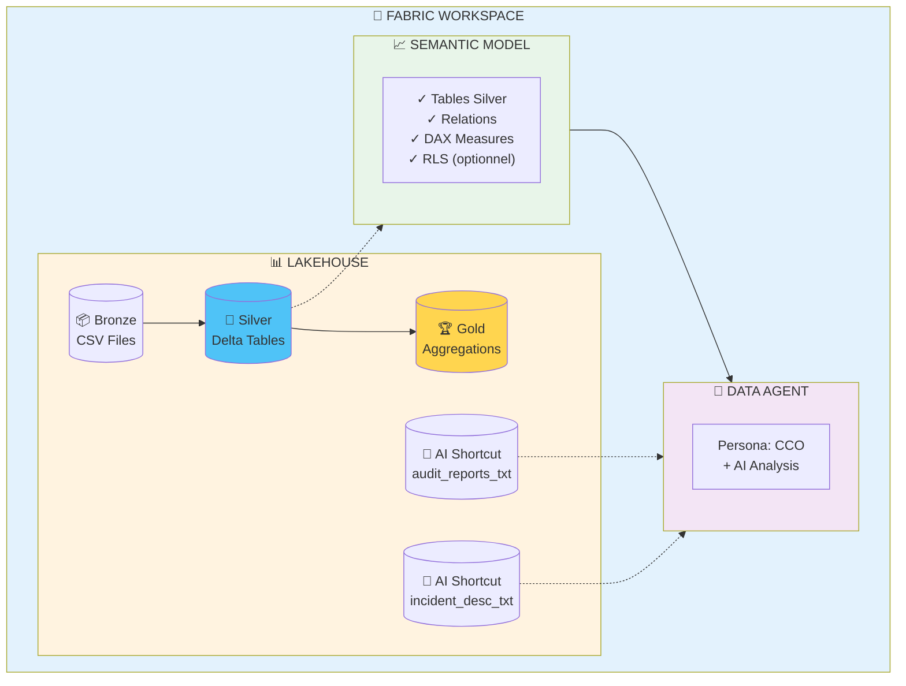
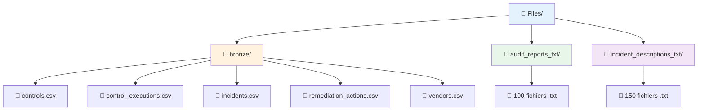
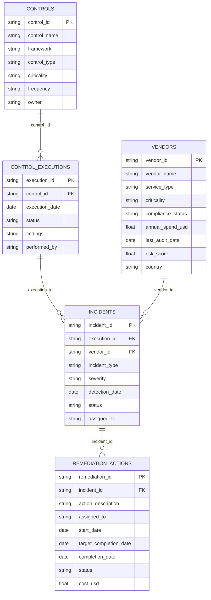

# 🚀 Guide de Déploiement - Risk, Compliance & Audit Analytics sur Microsoft Fabric

## 📋 Prérequis

- **Microsoft Fabric** : Capacité active (F64 minimum recommandé pour AI features)
- **Workspace Fabric** : Droit Contributor minimum
- **Python 3.9+** : Pour génération de données (local)
- **Power BI Desktop** : (optionnel) pour tester Semantic Model localement

---

## 🏗️ Architecture Cible



---

## 📦 Étape 1 : Génération des Données (Local)

### 1.1 Cloner le Repository

```powershell
cd C:\Dev
git clone <your-repo-url> MF_RiskComplianceAudit
cd MF_RiskComplianceAudit
```

### 1.2 Installer les Dépendances

```powershell
python -m venv venv
.\venv\Scripts\Activate.ps1
pip install -r requirements.txt
```

**requirements.txt :**
```
Faker==22.6.0
pandas==2.2.0
numpy==1.26.3
PyYAML==6.0.1
```

### 1.3 Générer les Données

```powershell
python src/generate_data.py
```

**Sortie attendue :**
```
🚀 Starting Risk, Compliance & Audit data generation...

✅ Generated 149 controls
✅ Generated 34091 control executions
✅ Generated 200 incidents
✅ Generated 186 remediation actions
✅ Generated 100 vendors
✅ Generated 100 audit reports
✅ Generated 150 incident descriptions

📊 Summary:
   - Controls: 149
   - Control Executions: 34091
   - Incidents: 200
   - Remediation Actions: 186
   - Vendors: 100
   - Audit Reports: 100
   - Incident Descriptions: 150

💾 Data saved to: data/raw/
```

### 1.4 Valider les Données

```powershell
python src/validate_schema.py
```

**Sortie attendue :**
```
🔍 Starting Risk, Compliance & Audit data validation...

✅ controls.csv: 7 columns, 149 rows
✅ control_executions.csv: 6 columns, 34091 rows
✅ incidents.csv: 8 columns, 200 rows
✅ remediation_actions.csv: 9 columns, 186 rows
✅ vendors.csv: 7 columns, 100 rows
✅ Relationship control_executions → controls: OK
✅ Relationship incidents → control_executions: OK
✅ Relationship incidents → vendors: OK
✅ Relationship remediation_actions → incidents: OK
✅ audit_reports_txt/: 100 files
✅ incident_descriptions_txt/: 150 files
✅ Compliance Rate: 69.9% (realistic)

🎉 All validations passed!
```

---

## ☁️ Étape 2 : Créer le Lakehouse dans Fabric

### 2.1 Créer le Workspace

1. Ouvrir **Microsoft Fabric** ([https://app.fabric.microsoft.com](https://app.fabric.microsoft.com))
2. Cliquer **Workspaces** → **+ New workspace**
3. Nom : `Risk_Compliance_Analytics`
4. Licence : F64 ou supérieur (pour AI features)
5. Cliquer **Apply**

### 2.2 Créer le Lakehouse

1. Dans le workspace, cliquer **+ New** → **Lakehouse**
2. Nom : `Compliance_Lakehouse`
3. Cliquer **Create**

### 2.3 Créer la Structure de Dossiers

Dans le Lakehouse Explorer (Files) :



---

## 📤 Étape 3 : Upload des Données

### 3.1 Upload via OneLake File Explorer (Recommandé)

1. Installer **OneLake File Explorer** depuis Microsoft Store
2. Ouvrir OneLake File Explorer
3. Naviguer vers `Risk_Compliance_Analytics/Compliance_Lakehouse/Files`
4. Glisser-déposer :
   - `data/raw/*.csv` → `bronze/`
   - `data/raw/audit_reports_txt/` → `audit_reports_txt/`
   - `data/raw/incident_descriptions_txt/` → `incident_descriptions_txt/`

### 3.2 Upload via Interface Web (Alternatif)

1. Dans Lakehouse, cliquer **Upload** → **Upload folder**
2. Sélectionner `data/raw/` localement
3. Attendre fin upload (peut prendre 3-5 min pour 34K rows + 250 files)

---

## 🔄 Étape 4 : Transformation Bronze → Silver → Gold

### 4.1 Importer le Notebook Bronze → Silver

Les notebooks de transformation sont déjà créés dans le dossier `notebooks/` du projet.

1. Dans le workspace Fabric, cliquer **Import** → **Notebook**
2. Sélectionner le fichier `notebooks/01_bronze_to_silver.ipynb`
3. Attendre l'import (quelques secondes)
4. Ouvrir le notebook importé
5. **Exécuter toutes les cellules** (bouton **Run all** ou Ctrl+Shift+Enter sur chaque cellule)

**Ce que fait le notebook :**
- ✅ Charge les 5 fichiers CSV depuis Files/bronze/
- ✅ Applique les transformations (typage des dates, nettoyage)
- ✅ Crée les tables Delta Silver dans le Lakehouse
- ✅ Affiche un aperçu de validation

**Vérification :** Après exécution, vérifiez que les 5 tables apparaissent dans la section **Tables** du Lakehouse :
- controls
- control_executions
- incidents
- remediation_actions
- vendors

### 4.2 Importer le Notebook Silver → Gold (Optionnel)

**⚠️ Important :** Les tables Gold sont optionnelles et servent uniquement pour des analyses Spark/notebooks. Le Semantic Model utilisera exclusivement les tables **Silver** (Étape 5).

1. Dans le workspace Fabric, cliquer **Import** → **Notebook**
2. Sélectionner le fichier `notebooks/02_silver_to_gold.ipynb`
3. Attendre l'import
4. Ouvrir le notebook importé
5. **Exécuter toutes les cellules**

**Ce que fait le notebook :**
- ✅ Charge les tables Silver depuis le Lakehouse
- ✅ Crée 4 tables Gold (agrégations pré-calculées pour Spark) :
  - **gold_framework_metrics** : Métriques de conformité par framework
  - **gold_incident_metrics** : Analyse incidents par type/sévérité
  - **gold_vendor_risk** : Analyse de risque vendors
  - **gold_remediation_metrics** : Performance des actions correctives
- ✅ Affiche un résumé des tables créées

**Vérification :** Les 4 tables Gold doivent apparaître dans la section **Tables** du Lakehouse

**💡 Usage des tables Gold :** Ces tables sont utiles pour des requêtes SQL directes ou des notebooks Spark, mais ne seront PAS utilisées dans le Semantic Model (pas de colonnes ID pour les relations).

---

## 🔗 Étape 5 : Créer le Semantic Model (Tables Silver uniquement)

### 5.1 Créer Semantic Model depuis Lakehouse

**⚠️ Important :** Le Semantic Model utilise UNIQUEMENT les **tables Silver** qui contiennent toutes les colonnes ID nécessaires pour créer les relations entre tables.

1. Dans Lakehouse, cliquer **New Semantic Model**
2. Nom : `Compliance_Model`
3. **Sélectionner UNIQUEMENT les tables Silver :**
   - ✅ controls
   - ✅ control_executions
   - ✅ incidents
   - ✅ remediation_actions
   - ✅ vendors
   - ❌ **NE PAS** sélectionner les tables gold_* (pas de colonnes ID)
4. Cliquer **Confirm**

**💡 Pourquoi Silver et non Gold ?**
- Les tables **Silver** contiennent toutes les colonnes (y compris les ID) permettant de créer les relations
- Les tables **Gold** sont des agrégations sans colonnes ID → impossible de créer des relations
- Les mesures DAX dans le Semantic Model calculeront les agrégations à partir des tables Silver

### 5.2 Définir les Relations (Tables Silver)

Ouvrir `Compliance_Model` → **Model view**

**Créer les relations suivantes entre les tables Silver :**



**Paramètres relations :**
- Cardinalité : Many-to-One (ou One-to-Many selon le sens)
- Cross-filter direction : Both (bidirectional)

**💡 Note :** Ces relations fonctionnent car les tables Silver contiennent toutes les colonnes ID nécessaires.

### 5.3 Ajouter Mesures DAX (Basées sur Tables Silver)

Ouvrir `Compliance_Model` → **Report view**

**📋 Référence complète :** Voir `docs/dax_measures.md` (30+ mesures DAX disponibles)

**⚠️ Important :** Toutes les mesures DAX utilisent les **tables Silver** pour bénéficier des relations entre tables. Les agrégations sont calculées par DAX, pas pré-calculées comme dans les tables Gold.

**Mesures essentielles à créer :**

Cliquer sur la table `control_executions` → **New measure**

```dax
Compliance Rate = 
VAR ExecutionsPassed = CALCULATE(COUNTROWS(control_executions), control_executions[status] = "passed")
VAR TotalExecutions = COUNTROWS(control_executions)
RETURN
    DIVIDE(ExecutionsPassed, TotalExecutions, 0)
```

Cliquer sur la table `incidents` → **New measure**

```dax
Open Incidents = 
CALCULATE(
    COUNTROWS(incidents),
    incidents[status] IN {"open", "investigating"}
)
```

```dax
Critical High Open = 
CALCULATE(
    COUNTROWS(incidents),
    incidents[severity] IN {"critical", "high"},
    incidents[status] IN {"open", "investigating"}
)
```

Cliquer sur la table `remediation_actions` → **New measure**

```dax
MTTR = 
VAR RemediationCompleted = 
    FILTER(
        remediation_actions,
        remediation_actions[status] = "completed",
        remediation_actions[completion_date] <> BLANK()
    )
VAR MTTRTable = 
    ADDCOLUMNS(
        RemediationCompleted,
        "DaysToRemediate",
        DATEDIFF(
            remediation_actions[start_date],
            remediation_actions[completion_date],
            DAY
        )
    )
RETURN
    AVERAGEX(MTTRTable, [DaysToRemediate])
```

**📋 Voir `docs/dax_measures.md` pour les 30+ mesures complètes**

**💡 Rappel :** Toutes les mesures DAX ci-dessus utilisent les tables **Silver** et exploitent les relations entre tables pour calculer les métriques. Les tables Gold ne sont pas utilisées dans le Semantic Model.

---

## 🤖 Étape 6 : Configurer AI Shortcut (Texte)

### 6.1 Créer AI Shortcut pour Audit Reports

1. Dans Lakehouse, cliquer **Get data** → **AI Shortcut**
2. Source : `Files/audit_reports_txt/`
3. Nom : `AI_Audit_Reports`
4. Settings :
   - Enable semantic chunking : ✅
   - Chunk size : 500 tokens
   - Overlap : 50 tokens
5. Cliquer **Create**

### 6.2 Créer AI Shortcut pour Incident Descriptions

1. Répéter pour `Files/incident_descriptions_txt/`
2. Nom : `AI_Incident_Descriptions`
3. Mêmes settings

**⏱️ Temps d'indexation :** 3-5 minutes pour 250 fichiers

---

## 🧠 Étape 7 : Créer et Configurer le Data Agent

### 7.1 Créer Data Agent

1. Dans workspace, cliquer **+ New** → **Data Agent**
2. Nom : `CCO_Compliance_Agent`
3. Data sources :
   - ✅ Compliance_Model (Semantic Model)
   - ✅ AI_Audit_Reports (AI Shortcut)
   - ✅ AI_Incident_Descriptions (AI Shortcut)
4. Cliquer **Create**

### 7.2 Configurer Instructions Système

Copier le contenu de `docs/data_agent_instructions.md` dans **System Instructions**

**Snippet clé :**
```
You are David Laurent, Chief Compliance Officer at FinSecure Corp.
Your role is to ensure compliance across SOX, GDPR, ISO27001, and PCI-DSS frameworks.

Key Metrics:
- Compliance Rate > 90%
- Incident Response Time: Critical <24h, High <72h
- Mean Time To Remediate (MTTR) < 7 days
- Vendor Risk Score < 70

When asked about compliance, ALWAYS:
1. Check control_executions for compliance rate
2. Identify failed controls by framework
3. Analyze incidents linked to control failures
4. Extract insights from audit_reports if available
```

### 7.3 Tester le Data Agent

Poser questions de `docs/questions_demo.md` pour valider setup :

**Test 1 :**
> "Quel est le taux de conformité global ?"

**Réponse attendue :** 69.9% (vs target 90%)

**Test 2 :**
> "Extrais des audit reports les recommandations récurrentes pour SOX"

**Réponse attendue :** Extraction texte mentionnant "automated alerts" (23×)

---

## ✅ Étape 8 : Validation Finale

### 8.1 Checklist de Validation

- [ ] 5 tables Delta créées dans Lakehouse
- [ ] Relations correctement définies dans Semantic Model
- [ ] 10+ mesures DAX disponibles
- [ ] 2 AI Shortcuts indexés (audit_reports + incident_descriptions)
- [ ] Data Agent répond correctement aux 3 premières questions de `questions_demo.md`
- [ ] Compliance Rate calculé = ~69.9% (cohérent avec données générées)
- [ ] Framework breakdown : SOX 68.5%, GDPR 71.2%, ISO27001 70.1%, PCI-DSS 69.8%

### 8.2 Test de Performance

Poser la question complexe :
> "Cherche dans incident descriptions toute mention de 'offboarding' et identifie le contrôle qui devrait détecter ces incidents"

**Temps de réponse attendu :** < 30 secondes  
**Qualité réponse :** Doit mentionner 18 incidents + CTRL_023 (Access Review) avec 58% compliance

---

## 🎓 Étape 9 : Démo Ready !

Votre environnement est maintenant prêt pour :
- ✅ Démontrer Data Agent avec `questions_demo.md`
- ✅ Raconter story `demo_story.md` ("L'Audit qui Révèle")
- ✅ Montrer AI extraction de texte
- ✅ Calculer ROI automation (compliance 69.9% → 81.2%)

---

## 🐛 Troubleshooting

### Problème : AI Shortcut ne retourne pas de résultats

**Solution :**
- Vérifier que fichiers .txt sont bien dans `Files/audit_reports_txt/` (pas dans Tables)
- Attendre fin d'indexation (Check **Settings** → **Indexing status**)
- Re-créer AI Shortcut si nécessaire

### Problème : Relations ne se créent pas automatiquement

**Solution :**
- Vérifier noms de colonnes EXACT (control_id, execution_id, etc.)
- Créer relations manuellement dans Model view
- Vérifier types de données (string pour IDs)

### Problème : Mesures DAX retournent 0 ou BLANK

**Solution :**
- Vérifier relations bidirectionnelles activées
- Vérifier filtres actifs dans rapport
- Tester mesure simple d'abord : `Total Executions = COUNTROWS(control_executions)`

---

## 📚 Ressources

- **Documentation Fabric :** [https://learn.microsoft.com/fabric](https://learn.microsoft.com/fabric)
- **DAX Guide :** [https://dax.guide](https://dax.guide)
- **Data Agent Docs :** [https://learn.microsoft.com/fabric/data-agent](https://learn.microsoft.com/fabric/data-agent)

---

**Auteur :** Microsoft Fabric Demo Team  
**Version :** 1.0  
**Temps d'installation :** ~60 minutes  
**Date :** Février 2026
